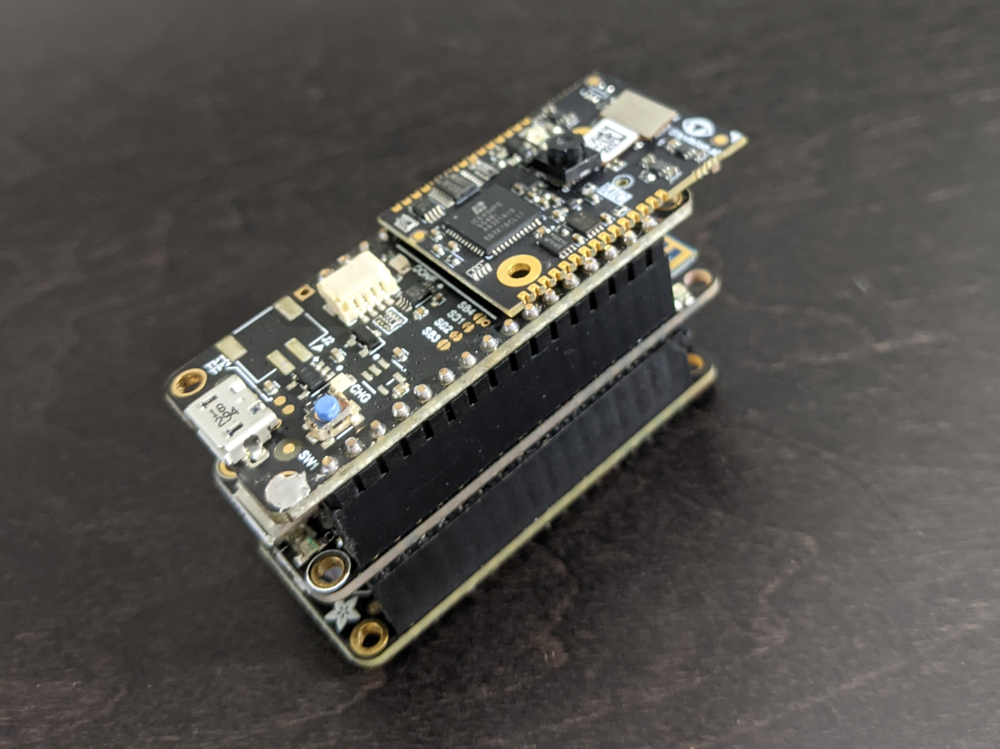

# Small Battery-powered Image Logger



This image logger is based on the [Vision FPGA SoM](https://www.crowdsupply.com/tinyvision-ai/vision-fpga-som) from [tinyVision.ai](https://tinyvision.ai/).  It captures up to 1 image per second from the 320x320 Bayer filtered image sensors and writes the raw images to an SD card.  Details of the build can be found on hackster io: [Battery-powered Image Logger](https://www.hackster.io/sthibault/battery-powered-image-logger-3a6c0e).

## Programming the FPGA

The FPGA image can be found in the `fpga` folder.  To program the FPGA using the developer kit, set the DIP switches as follows:

| Functionality | SW1-6	| SW1-7	| SW1-8	| Description |
| :---:         | ---:  |  ---: | ---:  |--- |
| Flash         | On 	| On   	| Off   | FTDI connected to FPGA flash |

Create a new project in the Radiant programmer and select the iCE40UP5K device from the iCE40 UltraPlus family.

Use the following SPI Flash Options:

* Family: SPI Serial Flash
* Vendor: WinBond
* Device: W25x40CL
* Package: 8-pad USON

## Programming the microcontroller

Open the `sketch/sd_logger.ino` sketch in the Arduion IDE and upload to the Feather board.

The Adafruit website has detail instructions for using the Arduino IDE with the Feather M0, see: [Arduino IDE Setup](https://learn.adafruit.com/adafruit-feather-m0-wifi-atwinc1500/setup)

## Usage

On power up, the sketch will search for the first unused filename and start capturing images after about 10 seconds.  By default, it will capture 1 image per second.  The RGB light on the SoM is initially blue, but will change colors every time it captures an image so you can tell if it is working.

The images will be written to the card with filenames like `CAMnnnn.PGM`.  PGM is a very simple format that is easy to create.  To convert the grayscale Bayer format images to RGB, install the `sxlogic` Python package:

```
python -m pip install sxlogic
```

You can convert all the images on the card in one go using:
```
python -m sxlogic.iconvert --debayer --glob F:\*.*
```

Try running with `-h` for more options.
